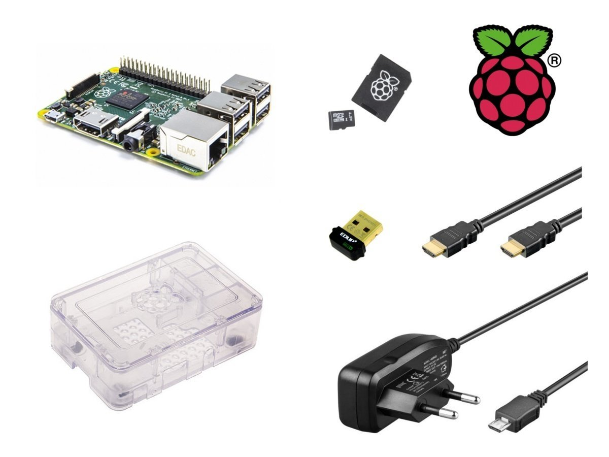

## Materiales

¿Qué necesito para trabajar con la Raspberry Pi?

### Componentes Obligatorios

* Raspberry Pi Ahora mismo recomendaría una 3B+ frente a la 4, salvo que necesitemos aplicaciones muy pesadas
* Fuente de alimentación de 5V con conector micro-USB con al menos 2A (mejor si son 2.5A) y 3A con USB-C para la Raspberry 4
* Tarjeta SD de al menos 16 GB  o más (recomendados 32Gb con un [máximo 128Gb](https://www.raspberrypi.org/help/faqs/#sdMax)). Se recomienda de clase 10 por su velocidad. La calidad de la tarjeta es crítica, en tarjetas baratas con problemas de rendimiento nos vamos a encontrar cuelgues inesperados e incluso puede que no arranque.

Y si la vas a usar como un ordenador

* Monitor y cable HDMI (o adaptador VGA. Existen muchos tipos de conversores, pero no todos funcionan bien con cables largos)
* Teclado y ratón USB (mejor si es inalámbrico, porque consume menos)

### Material electrónico básico

* Leds de colores
* Resistencias variadas
* Pulsadores
* Led RGB
* Servo
* Protoboard
* Cables de conexión
* Pantalla LCD I2C

### Opcionales

* Una caja o carcasa (para evitar problemas, es muy fácil hacer un contacto con algo metálico), también te puedes imprimir o montar una.
* Conexión a la red: Cable ethernet o dongle Wifi
* Hub USB con alimentación, así podremos añadir más dispositivos y evitaremos cargar la potencia de la Raspberry

### ¿Dónde encontrarlos?

* [Raspberry.org](http://Raspberry.org)
* [www.inven.es](http://www.inven.es)
* [www.electan.com](http://www.electan.com)
* [www.amazon.es](http://www.amazon.es)
* [www.bricogeek.com](http://www.bricogeek.com)
* [www.raspipc.com](http://www.raspipc.com)

#### Veamos algunos kits de Inven 
* [Raspberry](http://inven.es/raspberry-pi/557-kit-raspberry-pi-3-tarjeta-16gb-transformador-corriente.html)                      
* [Raspberry básico](http://inven.es/raspberry-pi/368-inven-pi3-kit-raspberry-pi-3-basico.html)

* [Raspberry completo](http://inven.es/raspberry-pi/369-inven-pi3-kit-raspberry-pi-3-completo.html)

* [Raspberry + electrónica](http://inven.es/raspberry-pi/370-inven-pi3-kit-raspberry-pi-3-electronica.html)

