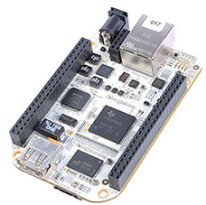
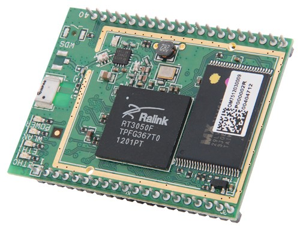

# Tema 2 - Características de Raspberry

En este tema vamos a hablar sobre el hardware de Raspberry

## Arquitectura

Un diagrama simplificado de la arquitectura de Raspberry Pi

En estos dibujos esquemáticos podemos ver los distintos conectores:

* USB: podremos conectar cualquier dispositivo USB, pero teniendo en cuenta que no debe consumir demasiado.
* HDMI: conectamos el monitor HDMI
* LAN: típico conector RJ45 para cable ethernet
* Algunas versiones tienen salidas de vídeo en formato RCA
* MicroUSB por el que alimentaremos
* Conector CSI para la cámara
* Conector DSI para un monitor específico
* GPIO, 40 pines accesibles para utilizar como entradas y salidas. Hay que tener mucho cuidado con ellos porque están conectados directamente el microprocesador y podríamos estropearlo fácilmente.

En este diagrama vemos los dispositivos que se pueden conectar a la Raspberry Pi

## Modelos

Hasta la fecha se han creado diferentes modelos, cada vez con mayores prestaciones.

En el siguiente enlace podemos leer en detalle sobre las diferentes  [Versiones](https://www.raspberrypi.org/documentation/hardware/raspberrypi/models/README.md)

Las versiones más actuales son la Raspberry 3 y la Zero.

La Raspberry Pi [Version 3](https://www.raspberrypi.org/products/raspberry-pi-3-model-b/) dispone de un procesador quad core a 1.2GHz con 1Gb, Wifi y bluetooth, 4 USB, HDMI, ethernet y salida de audio.

La Raspberry [Zero](https://www.raspberrypi.org/products/pi-zero/) es una versión superreducida con el mismo procesador pero a 1Ghz y  512Mb de RAM. La gran diferencia es que casi no dispone de conectores, para así reducir su tamaño y precio ¡Cuesta 5€!

### Versión antiguas

#### Raspberry Versión B
Tenía 512M de RAM, ethernet y 2 puertos USB

#### Raspberry Versión A
Apareció en 2011 y tenía 256MB de RAM, un único USB y no tenía conector Ethernet. Costaba unos 25€

#### [Versión 2 B](https://www.raspberrypi.org/products/raspberry-pi-2-model-b/)

El micro quad core va a 900MHz  y tiene 1Gb de RAM, 4 puertos USBs. Incorporan el nuevo formato de los 40 pines GPIO

#### [Versión B+](https://www.raspberrypi.org/documentation/hardware/raspberrypi/models/README.md#modelbplus)

En 2014 se libera esta versión con algunas mejoras internas, pero sin grandes cambios

[Vídeo](https://youtu.be/ZBq6ZPE5r9c) sobre los distintos modelos/versiones de Raspberry Pi

### Referencias

[Products at Raspberry.org](https://www.raspberrypi.org/products/)

[Tabla de los distintos modelos y sus características](https://es.wikipedia.org/wiki/Raspberry_Pi#Especificaciones_t.C3.A9cnicas)

## ¿Clones?

En el mercado han aparecido muchas empresas que sin llegar a copiar directamente la Raspberry, han producido equipos muy similares, en prestaciones y tamaños.

Además algunos de ellos, son treméndamente similares y a un precio sensiblemente inferior.

¿Dónde está el problema? Podemos encontrarnos con un hardware estupendo pero con una base de usuarios pequeña, lo que redundará en que tengamos poco software y pocos desarrollos. Además el soporte en este tipo de hardware muchas veces viene más desde otros usuarios, vía foros, que del propio fabricante, con lo que a más usuarios más fácil es encontrar la solución a nuestros problemas.

Veamos algunos de ellos:

* BeagleBoard  ARM Cortex-A8 256MB 89€

  

* OLinuXino  Cortex A8 1GHz  512 MB 55€

  

* UDOO=raspberry+arduino
6 ARM Cortex-A9 CPU Dua/Quad core 1GHz
1GB

  

* Cubieboard ARM cortex-A8 y 512 MB 49$

  

* Carambola 8devices (32Mb RAM) 22$

* [Arduino Tre e Intel Galileo](http://blog.elcacharreo.com/2013/10/04/nuevos-arduino-galileo-y-tre/)

* [Nanode y waspmote](http://blogthinkbig.com/4-alternativas-arduino-beaglebone-raspberrypi-nanode-waspmote/)

* [Banana Pi](http://www.bananapi.org/) Es una de las más parecidas a Raspberry y se puede encontrar en varias versiones y a unos precios muy reducidos.

  

  En el esquema vemos que algunos modelos de hecho tienen más conectores que la Raspberry Pi (por ejemplo el conectr SATA)

  

  Los pines del conector GPIO son muy similares

  

* [PCDuino](http://www.linksprite.com/linksprite-pcduino/)

  

¿Conoces algún clon más? No dudes en decirlo.

[Vídeo](https://youtu.be/OX3YdERMgOo) sobre los clones de Raspberry Pi

### Referencias

[Alternativas](http://blogthinkbig.com/alternativas-raspberry-pi/)

[Otras placas similares](http://en.wikipedia.org/wiki/Raspberry_Pi#See_also)

[Comparativa entre clones](https://learn.adafruit.com/embedded-linux-board-comparison?view=all)

[Qué modelo compro](https://descubrearduino.com/comprar-raspberry-pi/)
