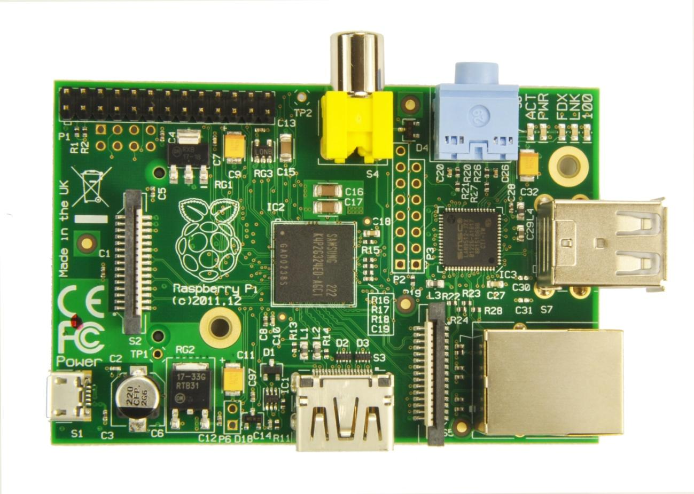
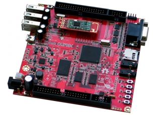

# Tema 2 - Características de Raspberry

En este tema vamos a hablar sobre el hardware de Raspberry

## Arquitectura

En este diagrama simplificado puedes ver la arquitectura de una Raspberry Pi 

Vemos que tiene un bloque central con la CPU y GPU, un frontal con conectores USB y Ethernet, en un lateral la salida HDMI y en el lateral opuesto un doble fila de pines, llamados GPIO donde podremos conectar nuestros proyectos de electrónica.

Su tamaño es realmente pequeño: 86x57 mm

A lo largo das distintas versiones ha ido evolucionando. Veamos los dos modelos más recientes

### Raspberry Pi 3 

En estos dibujos esquemáticos podemos ver los distintos conectores:

* USB: podremos conectar cualquier dispositivo USB, pero teniendo en cuenta que no debe consumir demasiado.
* HDMI: conectamos el monitor HDMI
* LAN: típico conector RJ45 para cable ethernet
* Algunas versiones tienen salidas de vídeo en formato RCA
* MicroUSB por el que alimentaremos
* Conector CSI para la cámara
* Conector DSI para un monitor específico
* GPIO, 40 pines accesibles para utilizar como entradas y salidas. Hay que tener mucho cuidado con ellos porque están conectados directamente el microprocesador y podríamos estropearlo fácilmente.

### Raspberry Pi 4

Veamos las diferencias:

* 2 USB 3.0 y 2 USB 2.0
* LAN Gigabit
* 2 x mini-HDMI
* Alimentación via USB-C

### Raspberry Pi V3+ vs V4

||Raspberry Pi 4	|Raspberry Pi 3 B+
|---|---|---
|CPU|Broadcom BCM2711, Quad coreCortex-A72 (ARM v8) 64-bit SoC @ 1.5GHz	|Broadcom BCM2837B0 quad-core A53 (ARMv8) 64-bi @ 1.4GHz
|GPU|	Broadcom VideoCore VI|	Broadcom Videocore-IV
|RAM|	1 GB, 2 GB, or 4 GB LPDDR4 SDRAM	|1 GB LPDDR2 SDRAM
|Bluetooth|	Bluetooth 5.0, BLE	|Bluetooth 4.2, BLE
|Display & audio port	|2 × micro-HDMI 2.0, 3.5 mm analogue audio-video jack|	Full size – HDMI, 3.5 mm analogue audio-video jack,
|USB	|2x USB 3.0 + 2x USB 2.0	|4x USB 2.0
|Ethernet|	Native Gigabit Ethernet	|300 Mbps Giga Ethernet
|Video Decoder|	H.265 4Kp60, H.264 1080p60|	H.264 & MPEG-4 1080p30
|Power Supply|	5V via USB type-C up to 3A and GPIO header up to 3A| 5V via micro USB up to2.5A and GPIO header up to 3A
|Expansion|	40-pin GPIO header|40-pin GPIO header
|Wifi	|2.4 GHz and 5 GHz 802.11b/g/n/acwireless LAN	|2.4 GHz and 5 GHz 802.11b/g/n/ac wireless LAN
|Storage|	microSD card	|microSD card
|Price	$35 – 1 GB RAM, $45 – 2 GB RAM, $55 – 4 GB RAM	|$35 – 1 GB RAM

Cómo podemos ver la V4 gana en todas las características 

[Fuente: seeedstudio](http://www.seeedstudio.com/blog/2019/09/30/raspberry-pi-4-vs-pi-3-all-the-major-differences)

## Dispositivos para conectar

En este diagrama vemos los dispositivos que se pueden conectar a la Raspberry Pi

Como vemos a la hora de conectar dispositivos y con el fin de cargar la fuente de alimentación deberíamos intentar usar dispositivos autoalimentados, incluir un HUB USB alimentado y en la medida de lo posible usar teclado y ratón innalámbricos.

## Modelos

Hasta la fecha se han creado diferentes modelos, cada vez con mayores prestaciones.

En el siguiente enlace podemos leer en detalle sobre las diferentes [versiones](https://es.wikipedia.org/wiki/Raspberry_Pi)

(falta la v4)

Las versiones más actuales son la Raspberry 4 (de la hablamos en detalle poco más adelante) y la Zero.

La Raspberry [Zero](https://www.raspberrypi.org/products/pi-zero/) es una versión superreducida con el mismo procesador pero a 1Ghz y  512Mb de RAM. La gran diferencia es que casi no dispone de conectores, para así reducir su tamaño y precio ¡Cuesta 5€!

¿Para qué elegir un modelo u otro? La Zero tiene la ventaja de un tamaño muy reducido y por tanto es ideal para proyectos móviles o que necesitamos "esconder". Por otro lado tiene menor capacidad de procesamiento y de memoria RAM lo que la inutiliza para proyectos que requieran un mayor rendimiento.

### Versión antiguas

#### Raspberry Versión B
Tenía 512M de RAM, ethernet y 2 puertos USB

#### Raspberry Versión A
Apareció en 2011 y tenía 256MB de RAM, un único USB y no tenía conector Ethernet. Costaba unos 25€

#### [Versión 2 B](https://www.raspberrypi.org/products/raspberry-pi-2-model-b/)

El micro quad core va a 900MHz  y tiene 1Gb de RAM, 4 puertos USBs. Incorporan el nuevo formato de los 40 pines GPIO

#### [Versión B+](https://www.raspberrypi.org/documentation/hardware/raspberrypi/models/README.md#modelbplus)

En 2014 se libera esta versión con algunas mejoras internas, pero sin grandes cambios

[Vídeo](https://youtu.be/ZBq6ZPE5r9c) sobre los distintos modelos/versiones de Raspberry Pi

## Raspberry Pi 4

Veamos más detalles sobre la Raspberry pi 4

Es un gran avance en cuanto a prestaciones, pero conservando su esencia: un mismo tamaño, compatibilidad con las anteriores versiones y un precio base alucinante: desde 35$

Veamos algunas de sus características

* Procesador Quad core ARM A8 de 64 bits a 1.5Ghz. Los primeros tests de velocidad dicen que 2x veces más rápida que la 3+

* Compatible con OpenGL 3, con lo que esperemos que software 3D debe mejorar enormemente
* 3 Versiones con diferente cantidad de memoria RAM:  1Gb, 2Gb y 4Gb. Este aumento debe hacer que el rendimiento mejore mucho en aplicaciones pesadas como son los navegadores web 
* Doble salida mini-HDMI de 4K (personalmente no me gusta que sea mini-HDMI)
* 2 USB de tipo 3  y  2 USB de tipo 2
* Full Gigabit Ethernet real con POE (estándar de alimentación via red ethernet). Según los test de velocidad de transferencia por fin se ha eliminado la arquitectura de red conectada vía USB y el cambio es espectacular

  

* Wifi 2.4GHz y 5GHz b/g/n/ac
* Bluetooth 5.0 Low Energy (BLE)
* GPIO de 40 pines como en anteriores versiones
* Necesita 15W (5V y 3A) de alimentación,  y se ha pasado al USB-C para la alimentación. Según los test el consumo no ha subido en la misma proporción.

Como vemos está muy, muy cerca de las prestaciones de un portátil estándar a día de hoy

Esas aulas de ordenadores van a echar humo...

Se han encontrado algunos problemas en el diseño de la parte de alimentación lo que hace que algunos cargadores no funcionen bien.

También se han visto problemas de sobrecalentamiento, lo que hace necesario usar disipadores y ventiladores en la caja

La posibilidad de elegir entre varios tamaños de RAM es muy interesante, pero también encarece el precio. Antes de comprar deberíamos pensar si vamos a necesitar tanta capacidad

### Referencias

[Products at Raspberry.org](https://www.raspberrypi.org/products/)

[Tabla de los distintos modelos y sus características](https://es.wikipedia.org/wiki/Raspberry_Pi#Especificaciones_t.C3.A9cnicas)

## ¿Clones?

En el mercado han aparecido muchas empresas que sin llegar a copiar directamente la Raspberry, han producido equipos muy similares, en prestaciones y tamaños.

Además algunos de ellos, son treméndamente similares y a un precio sensiblemente inferior.

¿Dónde está el problema? Podemos encontrarnos con un hardware estupendo pero con una base de usuarios pequeña, lo que redundará en que tengamos poco software y pocos desarrollos. Además el soporte en este tipo de hardware muchas veces viene más desde otros usuarios, vía foros, que del propio fabricante, con lo que a más usuarios más fácil es encontrar la solución a nuestros problemas.

Veamos algunos de ellos:

* BeagleBoard  ARM Cortex-A8 256MB 89€

  

* OLinuXino  Cortex A8 1GHz  512 MB 55€

  

* UDOO=raspberry+arduino
6 ARM Cortex-A9 CPU Dua/Quad core 1GHz
1GB

  

* Cubieboard ARM cortex-A8 y 512 MB 49$

  

* Carambola 8devices (32Mb RAM) 22$

* [Arduino Tre e Intel Galileo](http://blog.elcacharreo.com/2013/10/04/nuevos-arduino-galileo-y-tre/)

* [Nanode y waspmote](http://blogthinkbig.com/4-alternativas-arduino-beaglebone-raspberrypi-nanode-waspmote/)

* [Banana Pi](http://www.bananapi.org/) Es una de las más parecidas a Raspberry y se puede encontrar en varias versiones y a unos precios muy reducidos.

  

  En el esquema vemos que algunos modelos de hecho tienen más conectores que la Raspberry Pi (por ejemplo el conectr SATA)

  

  Los pines del conector GPIO son muy similares

  

* [PCDuino](http://www.linksprite.com/linksprite-pcduino/)

  

¿Conoces algún clon más? No dudes en decirlo.

[Vídeo](https://youtu.be/OX3YdERMgOo) sobre los clones de Raspberry Pi

### Referencias

[Alternativas](http://blogthinkbig.com/alternativas-raspberry-pi/)

[Otras placas similares](http://en.wikipedia.org/wiki/Raspberry_Pi#See_also)

[Comparativa entre clones](https://learn.adafruit.com/embedded-linux-board-comparison?view=all)

[Qué modelo compro](https://descubrearduino.com/comprar-raspberry-pi/)
