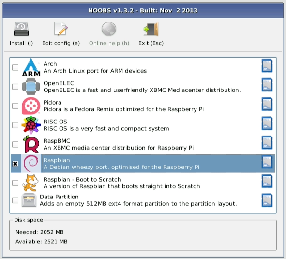
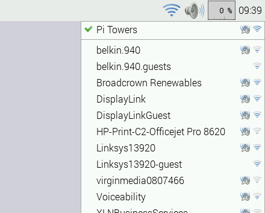
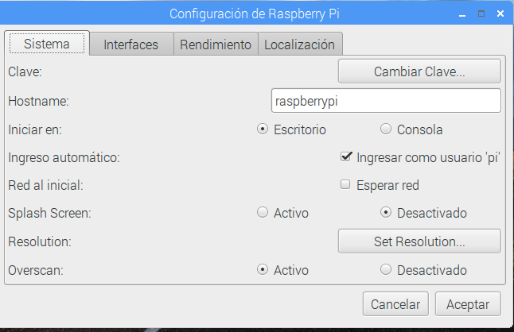
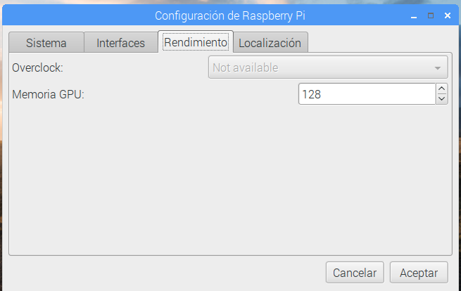
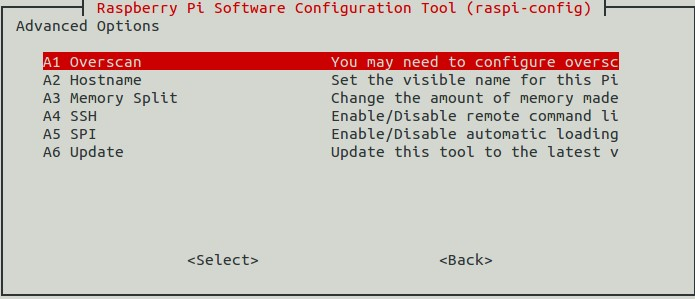

# Tema 3 - Instalación de Raspberry Pi

## Materiales

¿Qué necesito para trabajar con la Raspberry Pi?

### Componentes Obligatorios

* Raspberry Pi
* Fuente de alimentación de 5V con conector micro-USB con al menos 2A (mejor si son 2.5A)
* Tarjeta SD de al menos 4 GB  o más ([máximo 128Gb par la Raspberry Pi 3](https://www.raspberrypi.org/help/faqs/#sdMax)). Se recomienda de clase 10 por su velocidad. La calidad de la tarjeta es crítica, en tarjetas baratas con problemas de rendimiento nos vamos a encontrar cuelgues inesperados e incluso puede que no arranque.
* Cable de red ethernet (no es necesario si tenemos Wifi, pero facilita la primera conexión que no requiere configuración)

Y si la vas a usar como un ordenador

* Monitor y cable HDMI (o VGA con adaptador. Existen muchos tipos de conversores, pero no todos funcionan bien con cables largos)
* Teclado y raton USB (mejor si es inalámbrico, porque consume menos)

### Opcionales

* Una caja o carcasa (para evitar problemas, es muy fácil hacer un contacto con algo metálico)
* Conexión a la red: Cable ethernet o dongle Wifi
* Hub USB con alimentación, así podremos añadir más dispositivos y evitaremos cargar la potencia de la Raspberry

[¿Más carcasas?](https://www.google.es/search?q=raspberry+case&safe=off&espv=2&biw=838&bih=896&tbm=isch&tbo=u&source=univ&sa=X&ved=0CD4QsARqFQoTCP2a_r-_nMkCFci0GgodzpUMHA)

[Vídeo](https://youtu.be/m_cJlvNBRu0) sobre las cajas para Raspberry Pi

### ¿Dónde encontrarlos?

* [Raspberry.org](http://Raspberry.org)
* [www.inven.es](http://www.inven.es)
* [www.electan.com](http://www.electan.com)
* [www.amazon.es](http://www.amazon.es)
* [www.bricogeek.com](http://www.bricogeek.com)
* [www.raspipc.com](http://www.raspipc.com)

#### Veamos algunos kits de Inven (CODIGO de descuento: KITRASPI2017)

* [Raspberry](http://inven.es/raspberry-pi/557-kit-raspberry-pi-3-tarjeta-16gb-transformador-corriente.html)                      
* [Raspberry básico](http://inven.es/raspberry-pi/368-inven-pi3-kit-raspberry-pi-3-basico.html)

* [Raspberry completo](http://inven.es/raspberry-pi/369-inven-pi3-kit-raspberry-pi-3-completo.html)

* [Raspberry + electrónica](http://inven.es/raspberry-pi/370-inven-pi3-kit-raspberry-pi-3-electronica.html)

#### Otros kits

* [Kit base](http://www.electan.com/kit-raspberry-con-caja-alimentador-microsd-hdmi-usb-p-6584.html)
* [Shield electronica](http://tinkersphere.com/raspberry-pi-hats/633-starter-raspberry-pi-led-hat.html)
* [Kit amazon 1](http://www.amazon.es/s/ref=sr_pg_2?rh=i%3Aaps%2Ck%3Araspberry+pi+2+kit+starter&page=2&sort=price-asc-rank&keywords=raspberry+pi+2+kit+starter&ie=UTF8&qid=1449858467)
* [Kit Amazon 2 1](http://www.amazon.es/Raspberry-Pi-Quad-Core-Starter/dp/B00T7KW3Y0/ref=sr_1_15?ie=UTF8&qid=1449858467&sr=8-15&keywords=raspberry+pi+2+kit+starter)
* [Kit Amazon 3](http://www.amazon.es/Raspberry-Pi-Quad-Starter-Bundle/dp/B00T7OHE9A/ref=sr_1_18?ie=UTF8&qid=1449858497&sr=8-18&keywords=raspberry+pi+2+kit+starter)

* [Kit base](http://www.electan.com/kit-raspberry-con-caja-alimentador-microsd-hdmi-usb-p-6584.html)
* [Shield electronica](http://tinkersphere.com/raspberry-pi-hats/633-starter-raspberry-pi-led-hat.html)
* [kit amazon](http://www.amazon.es/s/ref=sr_pg_2?rh=i%3Aaps%2Ck%3Araspberry+pi+2+kit+starter&page=2&sort=price-asc-rank&keywords=raspberry+pi+2+kit+starter&ie=UTF8&qid=1449858467)

## Sistemas operativos disponibles

Existen muchos sistemas operativos (SO) disponibles para Raspberry, cada uno de ellos está pensado para un fin concreto.

Piensa que para cambiar entre SO, sólo tienes que apagar tu Raspberry, cambiar la tarjeta SD y volver a arrancar. Yo suelo tener varias SDs con los diferentes SO

### [Noobs](https://www.raspberrypi.org/downloads/noobs/)

Es un SO mínimo pensado para facilitar la instalación. Nos arranca el sistema y nos permite luego elegir qué sistema operativo instalar, y si tenemos suficiente espacio en la tarjeta, podremos instalar varios.

### [Raspbian](https://www.raspberrypi.org/downloads/raspbian/)

Es la versión para Raspberry de Debian (Linux). Es el sistema operativo más usado y contiene todo lo necesario.

### [Ubuntu Mate](https://ubuntu-mate.org/raspberry-pi/)

Es una versión de Ubuntu (Linux) para la Raspberry

### [Snappy Ubuntu Core](https://developer.ubuntu.com/en/snappy/start/#snappy-raspi2)

Es un Ubuntu (Linux) reducido al mínimo para funcionar en equipos más pequeños

### [Windows 10 IOT Core](http://ms-iot.github.io/content/en-US/Downloads.htm)

Es una versión reducida de Windows 10

### [OSMC](https://osmc.tv/download/)

Es un SO orientado a convertir la Raspberry Pi en un centro multimedia

### [Chrome OS](http://www.hwlibre.com/chrome-os-llega-raspberry-pi-otras-placas-sbc/)

### [Android](https://www.raspberrypi.org/magpi/android-raspberry-pi/)

### ([¿Dónde encontrarlos?](https://www.raspberrypi.org/downloads/))

Una vez elegida la imagen vamos a proceder a instalar

## Instalación

¿Qué necesitamos?

* Formatear tarjeta ([http://www.sdcard.org/downloads/formatter_4/](http://www.sdcard.org/downloads/formatter_4/))
* Descargamos la imagen del sistema que queramos [http://www.raspberrypi.org/download](http://www.raspberrypi.org/download)
* ¿Qué imagen usar?
	* Empecemos con [Noobs](https://www.raspberrypi.org/blog/tag/noobs/)
	* [Instalación de Noobs](https://www.raspberrypi.org/help/noobs-setup/)

	

* ¡¡¡Arrancar!!!

Aparecerá una pantalla multicolor

Y después se verá en formato texto el arranque

Si todo va bien veremos el escritorio Pixel

A la izquierda tenemos el menú de aplicaciones y a la derecha podemos pulsar sobre el icono del Wifi o de la red para configurarla si fuera necesario.

En este [Vídeo](https://www.youtube.com/embed/IrjWoxWfewo) podéis ver el uso del entorno visual  Pixel de Raspberry Pi

<iframe width="560" height="315" src="https://www.youtube.com/embed/IrjWoxWfewo" frameborder="0" allowfullscreen></iframe>

## Configuración

Existe un asistente para configurar la manera en la que funcionará nuestra Raspberry. Podemos hacerlo desde el menú de configuración

Al abrirlo veremos que hay 4 pestañas, cada una de ellas dedicada a unos aspectos diferentes de la configuración:

### Configuración del sistema

Aquí podemos decidir si el sistema arranca en modo texto o escritorio visual o la configuración de red.

Lo más importante es cambiar la contraseña para evitar que cualquiera pudiera entrar.

### Configuración de Interfaces

Aquí veremos qué drivers activamos (porque vayamos a usar esos dispositivos) o que protocolos de comunicación usaremos para acceder.

Si vamos a acceder desde otro ordenador deberemos activar SSH en el caso de  acceder vía consola (texto) o VNC para acceder al escritorio.

### Configuración de rendimiento

En la versión 3 de Raspberry no se puede cambiar la velocidad del procesador desde este interface (en las versiones anteriores sí), pero sí que podemos cambiar la cantidad de memoria que se asigna al procesador gráfico con lo que conseguiremos que aplicación que usan intensivamente gráficos vayan más rápidas

### Configuración de idiomas y teclado

Esta parte de la configuración es fundamental para configurar la zona horaria, el idioma (Local) y el teclado

<iframe width="560" height="315" src="https://www.youtube.com/embed/vHs_3HmI3mc" frameborder="0" allowfullscreen></iframe>

[Vídeo de la primera configuración de Raspberry Pi](https://youtu.be/vHs_3HmI3mc)

### Configuración desde consola

Si necesitamos configurar desde consola de texto  podemos lanzar la aplicación de configuración escribiendo:

	sudo raspi-config

Y obtendremos las pantallas de configuración. (Puede variar algo según la versión)

Una vez configurado podemos abrir el entorno visual con

	startx

En cualquier momento podemos volver a reconfigurar con

	sudo raspi-config

<iframe width="560" height="315" src="https://www.youtube.com/embed/ERFH8AYjWxM" frameborder="0" allowfullscreen></iframe>

[Vídeo de la configuración desde la consola de texto de Raspberry Pi](https://www.youtube.com/embed/ERFH8AYjWxM)

## Simuladores

¿Y si no tengo una Raspberry Pi?

Existen [varios emuladores](https://www.google.es/search?q=raspberry+simulator&oq=raspberry+simulator&aqs=chrome..69i57j69i65l3j69i60l2.3806j0j7&sourceid=chrome&es_sm=93&ie=UTF-8) aunque no esperes que la experiencia sea la misma....

### [En windows](http://www.diverteka.com/?p=66)

* Descargamos la imagen en  [http://sourceforge.net/projects/rpiqemuwindows/](http://sourceforge.net/projects/rpiqemuwindows/)
* Emulador qemu
* Imagen (2012-07-15-wheezy-raspbian.img) o (http://downloads.raspberrypi.org/download.php?file=/images/raspbian/2013-05-25-wheezy-raspbian/2013-05-25-wheezy-raspbian.zip)

* Ejecutamos

		qemu-system-arm.exe -M versatilepb -cpu arm1176 -hda imagen/2013-09-25-wheezy-raspbian.img -kernel kernel-qemu -m 192 -append "root=/dev/sda2"

[Vídeo](http://www.youtube.com/watch?feature=player_embedded&v=QvqaNUx7-pU)

### [En ubuntu](http://www.cnx-software.com/2011/10/18/raspberry-pi-emulator-in-ubuntu-with-qemu/)

### [Simulando en virtualBox](https://www.raspberrypi.org/forums/viewtopic.php?f=9&t=2961)

### [Simulando el Sense Hat](https://www.raspberrypi.org/blog/sense-hat-emulator/)

### Usando Pixel el entorno de Raspberry Pi en tu PC

Puedes usar Pixel el entorno gráfico de Rasperry en tu PC o MAC, solo necesitas descargar la [imagen](http://downloads.raspberrypi.org/pixel_x86/images/pixel_x86-2016-12-13/2016-12-13-pixel-x86-jessie.iso) desde un CD o USB.

Más detalles en [esta página](https://www.raspberrypi.org/blog/pixel-pc-mac/)
