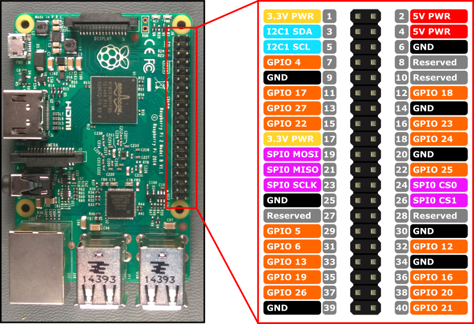
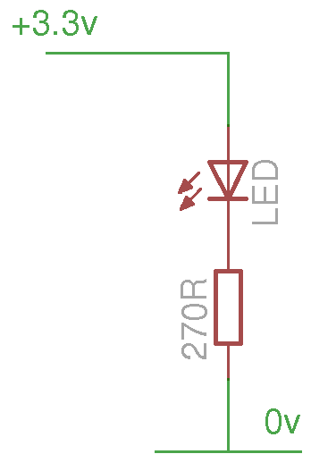
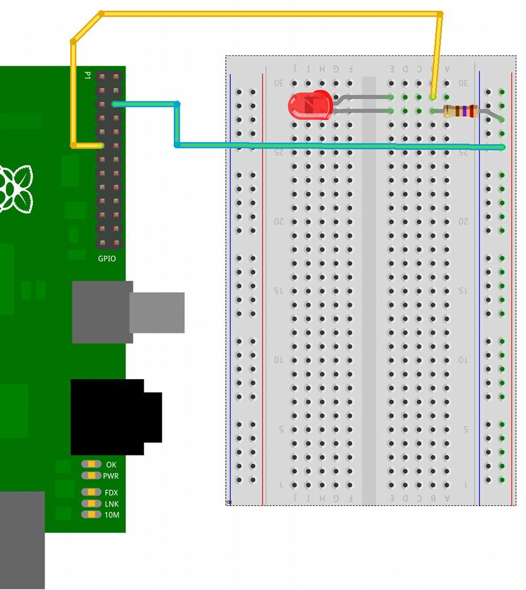
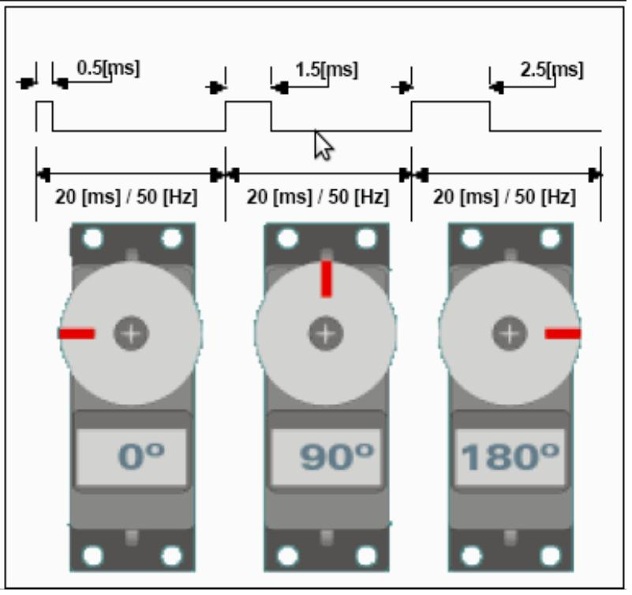

# Tema 10 - Electrónica con Raspberry Pi

En este tema vamos a ver como conectar dispositivos electrónicos a la Raspberry Pi.

## Cuidados eléctricos

Trabajar con electrónica es siempre algo delicado pero mucho más cuando trabajamos conectados a un ordenador.

* No existe protección en los terminales, con lo que es muy, muy sencillo quemar la placa.
* Cuidado con colocar la placa sobre un instrumento o superficie metálica. Mejor usar una caja
* Cuidado con los dispositivos que conectamos, pudieran demandar más potencia de la que le puede dar

* Antes de realizar cualquier tipo de conexión en los conectores o pines debemos de tener siempre la precaución de tener desconectada la alimentación de la Raspberry Pi.
* Evitaremos derivaciones eléctricas o cortos .
* Conviene recordar que los pines de la CPU de la placa están conectados directamente a los diferentes conectores y pines, con lo que cualquier cosa que hagamos sobre los pines la estamos haciendo directamente sobre la CPU.
* También hay que tener en cuenta que los pines GPIO no soportan 5 V, sólo 3.3V y un máximo de 16 mA, por lo que hay que tomar precauciones en este sentido.

## Adaptadores

Existen diferentes adaptadores que nos facilitan el uso de electrónica y ademas protegen a la Raspberry. En la sección de las placas hablaremos de ellas.

## Potencia

Los pines de la Raspberry no proporcionan potencia, si necesitas mñas potencia tendrás que añadir electrónica.

## GPIO

* Son los pines que podemos usar como salidas o como entradas, pero siempre de tipo digital.
* Utilizan **3.3V**
* Podemos configurar cada uno como entrada o como salida
* Algunos de ellos se pueden usar como comunicaciones especializadas: SPI, I2C, UART

## Pines

Hay que tener cuidado con no equivocarse. Podemos usar una etiqueta

O esta otra versión del gran @pighixxx con los diferentes etiquetados

[Añadir etiquetas a los gpio de Raspberry](https://youtu.be/9UiZ7m6UacM)

Las distintas versiones tienen algunos pines distintos

Las versiones de 40 pines

### Librerías

Hay 4 librerías GPIO que nos facilitarán el utilizarlos (todas en python)

* Shell (línea de comandos)
* Rpi. GPIO
* wiringPi (Gordon Henderson wiringpi.com)
* BCM 2835

Veamos como llaman a los distintos pines

#### Wiring

Para instalarlo tenemos que tener instalado parte del entorno de desarrollo de python

		sudo apt-get install python-dev python-pip

Descargamos el código (también podíamos haber descargado el fichero zip)

		sudo pip install wiringpi

La compilamos

		./build

Y ya podemos usarla

		gpio readall

### Conectando un led

Este es el esquema para conectar un led

El montaje sería

Hagamos un programa que parpadea el led conectado

		import time
		# Importamos la libreria wiringpi
		import wiringpi
		# Configuramos la numeracion de los pines con respecto al
		# estandar de la libreria wiringpi (pin de entrada salida
		#	GPIO0)

		io = wiringpi.GPIO(wiringpi.GPIO.WPI_MODE_PINS)

		# Configuramos el pin 0 como salida
		io.pinMode(0,io.OUTPUT)

		# Ciclo for que ejecutamos 3 veces
		for x in range (0,3):
			io.digitalWrite(0,io.HIGH) #encendemos el led
			time.sleep(0.5) # esperamos medio segundo
			io.digitalWrite(0,io.LOW) # apagamos el led
			time.sleep(0.5) # esperamos medio segundo

Para ejecutar estos programas necesitamos permiso de administrador

		sudo python blink.py

### Conectado un pulsador

Usando el código

		# Encendemos un led cuando se activa el pulsador
		import wiringpi

		io=wiringpi.GPIO(wiringpi.GPIO.WPI_MODE_PINS)

		io.pinMode(7,io.OUTPUT)  # Pin 7 como salida
		io.pinMode(0,io.INPUT)   # Pin 0 como entrada
		io.pullUpDnControl(0,io.PUD_UP)  # Resistencia pull-up

		while True:  # Hacemos un bucle sin fin
			x=io.digitalRead(0)  # Leemos el valor del pulsador
			if x==io.LOW: 	# Si esta pulsado valor bajo (por la resistencia pull-up)
				io.digitalWrite(7,io.HIGH)   # Activamos el led
			else:
				io.digitalWrite(7,io.LOW) 	# Apagamos el led

Vemos que para leer el pulsador activamos las resistencias pull-up, es decir cuando se pulse se pone en estado bajo, esto es lo que se conoce como  lógica invertida (o negativa). Aunque puede parecer raro, es como se suele utilizar en la industria pues aporta ventajas de conexión y mantenimiento.

### Usando GPIO

Instalamos la librería

		sudo apt-get install python-dev python-rpi.gpio

El programa que los usa

		import RPi.GPIO as GPIO
		# Usamos la numeración de los GPIO no el numero de los pines
		GPIO.setmode(GPIO.BCM)
		GPIO.setup(7, GPIO.IN) # establecemos el GPIO 7 como entrada
		GPIO.setup(8, GPIO.OUT) # establecemos el GPIO 8 como salida
		input_value = GPIO.input(7) # recuperamos el valor de entreda
		GPIO.output(8, True) # establecemos la salida en alto

O este ejemplo más complejo

		import RPi.GPIO as GPIO
		import time
		# Usamos la posición en el conector
		GPIO.setmode(GPIO.BOARD)
		# pin 11 (GPIO17) como output
		GPIO.setup(11, GPIO.OUT)
		var=1
		print "Empezamos el bucle infinito"
		while var==1 :
			print "Output False"
			GPIO.output(11, False)
			time.sleep(1) # esperamos un tiempo
			print "Output True"
			GPIO.output(11, True)
			time.sleep(1)

### Usando más potencia

En el caso bastante normal de que necesitemos más potencia de las que nos da un pin (16mA) Podemos utilizar un transistor. Veamos el montaje

A la salida de este transistor podemos conectar un relé para obtener aún más potencia

### Leyendo valores analógicos

Para leer valores analógicos usaremos electrónica externa, com pueden se [esta placa](http://www.abelectronics.co.uk/products/3/Raspberry-Pi/17/) o [esta otra](http://www.adafruit.com/products/1085), ambas de 16 bits. El [montaje es sencillo](http://learn.adafruit.com/reading-a-analog-in-and-controlling-audio-volume-with-the-raspberry-pi)

### Usos de los GPIOs

* Encender apagar LEDs (no podemos aspirar a encender nada de mayor potencia directamente). Estas son las salidas digitales, capaces de estar en estado alto o bajo.
* Algunos de estos pines pueden generar PWM (modulación por ancho de pulso) protocolo que usan los servos.
* Detectar pulsaciones de botones/interruptores. Estas son las entradas digitales.
• Acceso al puerto serie por los terminales TX/TX
• Acceso al bus I2C, bus de comunicaciones usado por muchos dispositivos
• Acceso al bus SPI, bus de comunicaciones similar al I2C pero con diferentes especificaciones

El bus I2C y SPI nos permiten conectar con dispositivos externos que nos
expanden su funcionalidad. Es como si conectáramos periféricos a nuestra
Raspberry.

* También están disponibles las líneas de alimentación de 5v y 3.3v y por supuesto tierra.

* Todos los pines se pueden configurar tanto de entrada como de salida.

* Algunos de los pines tienen una segunda función como por ejemplo los etiquetados como SCL y SDA utilizados para I2C y los MOSI, MISO y SCKL utilizados para conectar con dispositivos SPI.
* Hay que tener muy claro que todos los pines usan niveles lógicos de 3.3V y no es seguro conectarlos directamente a 5V, porque las entradas han de ser menores de 3.3V. Igualmente no podemos esperar salidas superiores a 3.3V.
* En caso de querer conectar con lógica de 5v tendremos que usar una electrónica para adaptar niveles.
* Existen dispositivos convertidores de niveles (level shifters) con diferentes tecnologías. Los más antiguos están formados por unas resistencias y unos transistores.

Para identificar más fácilmente los pines podemos usar una etiqueta

## Placas GPIO

Existen muchas placas que facilitan la conexión de electrónica

[Vídeo: Cómo conectar shields a RaspBerry Pi](https://www.youtube.com/watch?v=J9ZolkLrbdg)

### Clobber

* Es bastante arriesgado y complicado trabajar directamente con los pines del conector GPIO de la RaspBerry.
* Existen en el mercado una gran variedad de placas que nos facilitan la vida.
* Algunas sólo nos facilitan la conexión.
* Otras nos proporcionan mayor funcionalidad.
* En cualquier caso ganamos en tranquilidad al usarlas.

Son simples adaptadores que nos facilitan la vida permitiendo conectar de manera sencilla con las placas de prototipo

[Vídeo: Conectando electrónica a Raspberry - Cobbler DIY](https://youtu.be/CyNVsgw-t3U?list=PLDxBiw1MlK6SqyPGhhox9WlsximiNrcgK)

### PiPlate

Se trata de una placa de prototipo especialmente adaptada al tamaño de la Raspberry y que nos permite acceder de forma sencilla a los pines por nombre y funcionalidad.

[Video: Placa de prototipo para Raspberry Pi - Pi Plate](https://youtu.be/AB50mlF0ikU?list=PLDxBiw1MlK6SqyPGhhox9WlsximiNrcgK)

### PiFace

* Tiene un fin claramente educativo,
* Incluye diferentes dispositivos
* Leds que se pueden activar independientemente,
* 2 relés para activar cargas de potencia y
* 4 pulsadores conectados a otras tantas entradas

### Slice of I/O

Se trata de una p laca sencilla que nos permite acceder a 8 entradas y otras tantas salidas con la seguridad de que existe una electrónica que protege a nuestra RaspBerry

### Gertboard

Es una placa de desarrollo con una enorme cantidad de complementos, como son controladores de motores, ADC, DAC, 12 leds, 3 pulsadores y hasta un microcontrolador ATMega (similar a Arduino)

### RaspiRobot

* El manejo de motores es mucho más complejo que el manejo de leds.
* La programación es exactamente la misma,
* La electrónica necesaria para controlarlos es totalmente diferente.
* Si bien podemos conectar directamente un led a un pin de GPIO, conectar un motor es totalmente desaconsejable, por varias razones:
	* La primera porque los motores requieren de mayor potencia para funcionar,
	* Necesitaremos una electrónica capaz de gestionar estas potencias
	* Serán controladas desde los pines de la RaspBerry.
	* En caso de forzar la electrónica de alimentación de nuestra Raspberry a dar una mayor potencia podríamos quemarla.
	* El funcionamiento de los motores hace que estos generen al acelerar unas corrientes de inducción de sentido opuesto a las que les aplicamos para funcionar y que de no ser suprimidas podrían dañar la electrónica a la que están conectados.

En la [web de raspbirobot](https://github.com/simonmonk/raspirobotboard/wiki) vemos instrucciones de montaje

[Vídeo: Raspirobot - Controlando robots con Raspberry](https://youtu.be/FjjP8007DXA?list=PLDxBiw1MlK6SqyPGhhox9WlsximiNrcgK)

¿Qué podemos hacer con RaspiRobot?

* Controla 2 motores,
* 2 leds,
* 2 entradas de pulsador,
* 2 salidas de colector abierto, para poder usar mayores potencias
* Conector I2C y
* otro serie

Descargamos la librería

	wget https://github.com/simonmonk/raspirobotboard/archive/master.zip

y la instalamos

	sudo python setup.py install

Un programa podría ser

		from raspirobotboard import *
		rr = RaspiRobot() # creamos el objeto
		rr.set_led1(1) # activamos el led 1
		rr.set_led2(0) # desactivamos el led 2
		rr.set_oc1(1) # activamos la salida 1
		rr.forward() # movemos los dos motores hacia adelante
		rr.reverse() # movemos los dos motores hacia atrás
		rr.left() # motor izquierdo hacia adelante, derecho hacia atrás
		rr.right() # motor izquierdo hacia atrás, derecho hacia adelante
		rr.stop() # los dos motores hacia atrás
		rr.sw1_closed() # devuelver True o False según cerrado o abierto

### Steppers: motores paso a paso

Los motores paso a paso son motores que nos permiten una gran precisión de giro, pudiendo determinar su moviendo en grados.

Vamos a ver cómo usar el motor de la imagen, que tiene 4 bobinas. La placa de control es muy sencilla y necesita de 4 pines para controlarla (en realidad la placa sólo transforma la salida de los pines de raspberry en una señal de la potencia que necesita el motor)

Veamos como conectarla
	5V (P1-02)
	GND (P1-06)
	Inp1 (P1-18)
	Inp2 (P1-22)
	Inp3 (P1-24)
	Inp4 (P1-26)

Vamos a ver ahora la programación.

		import timeimport RPi.GPIO as GPIO
		GPIO.setmode(GPIO.BCM)
		StepPins = [24,25,8,7] # Pines que conectamos a la placa de control
		for pin in StepPins: # configuramos todos los pines como salida
			GPIO.setup(pin,GPIO.OUT)
			GPIO.output(pin, False)
			StepCounter = 0
			WaitTime = 0.5
			StepCount1 = 4
			Seq1 = []
			Seq1 = range(0, StepCount1) # Definimos la secuencia de giro
			Seq1[0] = [1,0,0,0]
			Seq1[1] = [0,1,0,0]
			Seq1[2] = [0,0,1,0]
			Seq1[3] = [0,0,0,1]
			while 1==1: # realizamos un bucle infinito enviando la secuencia
				for pin in range(0, 4): #iteramos sobre los pasos de la secuencia
					xpin = StepPins[pin]
					if Seq[StepCounter][pin]!=0:
						GPIO.output(xpin, True)
					else:
						GPIO.output(xpin, False)
					StepCounter += 1
					time.sleep(WaitTime)

Veamos un ejemplo de su precisión

		

### Servos

Los servos son motores pensados para mantener una posición concreta, disponen de electrónica de control propia y a la se le indica la posición que deben mantener mediante un pulso que hay que enviar 50 veces por segundo.

El ancho de este pulso determina la posición a mantener, como podemos ver en la imagen adjunta.

La estabilidad de la posición depende de la precisión con la enviemos la señal de control.

Veamos un método para generar esta señal con python. Está pensada para controlar 2 servos:

		def mover_servo(grados,servo):
			if servo==1: GPIO_servo=22
			elif servo==2: GPIO_servo=21
			# creamos el pulso
			pos_servo=(0.0000122*grados)+0.0002
			GPIO.output(GPIO_servo, True) #activamos la salida
			time.sleep(pos_servo) # esperamos la duración del pulso
			GPIO.output(GPIO_servo, False) # desativamos la señal porque el pulso ha terminado
			#esperamos el tiempo necesario hasta enviar el siguiente pulso
			time.sleep(0.0025-pos_servo)

Si lo probamos veremos que el servo vibra debido a la mala calidad de la señal por su falta de estabilidad. Python es un lenguaje interpretado y temporización que hemos hecho dependerá de la carga que tenga nuestra Raspberry

Podemos mejorar la calidad de la señal utilizando un programa escrito en C que producirá una mejor temporización.

### Uniéndolo todo

Vamos a utilizar un par de servos para hacer que una cámara [siga una cara](http://www.instructables.com/id/Pan-Tilt-face-tracking-with-the-raspberry-pi/?ALLSTEPS)

Estos son los pasos para instalar todo lo necesario

		sudo apt-get update
		sudo apt-get install git python-opencv python-all-dev libopencv-dev
		sudo modprobe servoblaster
		git clone https://github.com/mitchtech/py_servo_facetracker

Y para ejecutarlo

		cd py_servo_facetracker
		python ./facetracker_servo_gpio.py 0

### Motores

[Servo desde python](https://learn.adafruit.com/adafruits-raspberry-pi-lesson-8-using-a-servo-motor?view=all)

[Varios motores](https://learn.adafruit.com/adafruit-dc-and-stepper-motor-hat-for-raspberry-pi?view=all)

## Sensores

[Sensores de temperatura digitales](https://learn.adafruit.com/adafruits-raspberry-pi-lesson-11-ds18b20-temperature-sensing?view=all)

## Algunos enlaces

Veamos algunos enlaces interesantes sobre tutoriales de
electrónica
*  http://www.sc.ehu.es/sbweb/electronica/elec_basic
a/default.htm
*  http://www.tutoelectro.com/
*  http://www.electronicafacil.net/circuitos/
*  http://www.areatecnologia.com/
*  http://www.simbologia-electronica.com/
*  Un instructable que empieza desde lo más fundamental y llega hasta
montar un circuito oscilador con un 555. Lo más probable es que
cualquiera que tenga una mínima inquietud por el tema se pueda saltar
los primeros pasos, pero en cualquier caso vale la pena.
*  Otro instructable que explica diversos componentes y sus símbolos en
los esquemas
*  Un repositorio de circuitos enorme,
*  Un listado de bloques básicos para entender y crear circuitos
electrónicos
*  Estudios teóricos de electronica: el club de electrónica tiene montado un
muy completo grupo de tutoriales que abarcan desde los conceptos
básicos de la corriente eléctrica hasta ejemplose de curcuitos y
proyectos básicos, pasando por componentes, como por ejemplo los
transistores
*  Página de documentación de la tienda yourduino: Páginas interesantes
que he visto tratan sobre manejo de potencia con arduino, libros sobre

## Conexión con Arduino

Anteriormente vimos que Arduino y Raspberry Pi son perfecgamente complementarios.

Por tanto el conectarlos de manera que ambos puedan trabajar juntos parece que es la mejor idea.

A lo largo de este capítulo veremos varias formas de conectarlos, algunas utilizando un simple cable y otras con placas y electrónica de por medio.

Vamos a comenzar con la manera de conectarlos más sencilla, las que los conectan con cables

### Conectando vía cable

Las más sencillas son aquellas que conectan los puertos serie de ambos Esta conexión la podemos hacer de varias formas.

* Utilizando un cable USB, puesto que Arduino sólo consume (si no tiene nada conectado) en torno a los 50mA podemos alimentarlo sin problema del USB de la Raspberry.

* Utilizando un cable serie entre ambos puertos serie. Hay que tener en cuenta los diferentes voltajes

En cualquiera de los dos casos es necesario que desactivemos la consola serie de la Raspberry e instalemos la librería py-serial.

En [este tutorial](https://geekytheory.com/arduino-raspberry-pi-lectura-de-datos/) podemos ver cómo hacerlo.

Otra opción interesante es conectarlos utilizando el protocolo I2C, de esta forma la comunicación puede alcanzar más velocidad y nos serviría para conectar otros dispositivos I2C. En [este otro tutorial](https://oscarliang.com/raspberry-pi-arduino-connected-i2c/) se explica en detalle.

### Utilizando placas intermedias

Existen dispositivos pensados para facilitar esta comunicación. Veamos algunos de ellos

#### Alamode

Se trata de una placa compatible con Arduino que se conecta directamente a los GPIO de la Raspberry Pi y que dispone de su propia tarjeta SD

Más información en [este](http://www.internetdelascosas.cl/2013/09/11/alamode-un-arduino-para-raspberry-pi/) y [este enlace]( http://makezine.com/2012/12/12/new-product-alamode-arduino-compatible-shield-for-raspberry-pi/)

#### Paperduino pi

[Paperduino](http://paperpcb.dernulleffekt.de/doku.php?id=raspberry_boards:paperduinopi) es diseño de Arduino que se puede hacer directamente sobre una placa de prototipo y que está pensado para conectarlo directamente a la Raspberry

#### Raspberry Pi to arduino shield Bridge

[Esta placa](http://www.cooking-hacks.com/documentation/tutorials/raspberry-pi-to-arduino-shields-connection-bridge) nos permite crear una especie de emulador de Arduino, es decir, ejecutar proyectos de arduino (ino o pde) en la raspberry. Además tiene  conectores estándar de Arduino lo que nos permite conectar shield de arduino.
Hay que tener cuidado con los shields que conectamos puesto que podríamos tener problemas si estos funcionan en 5v y

### Instalando IDEs en Raspberry

Desde hace untiempo es posible instalar y usar el [IDE de Arduino](https://blogspot.tenettech.com/arduino-ide-running-on-raspberry-pi.html) y el de [Processing en la Raspberry Pi](http://cagewebdev.com/index.php/raspberry-pi-running-processing-on-your-raspi/). En los enlaces se puede ver el proceso de instalación.
