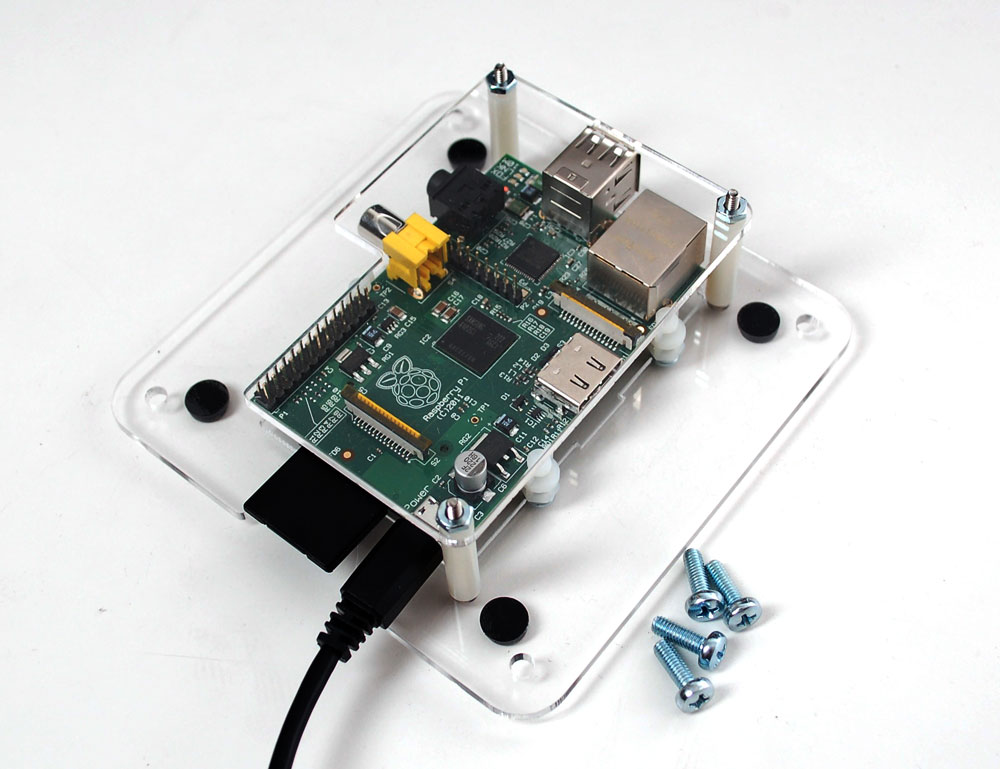
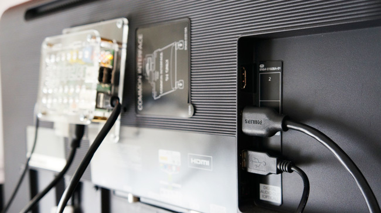

# Tema 7 - Proyectos con Raspberry Pi

## Jugando

Retropie

## Tuneando

Ejemplos mostrar la temperatura en la barra de tareas

Ventilador activado por temperatura

## Trabajando con ARduino

conexión arduino-raspberry
Instalación de IDE de arduino

## Centro multimedia

Además de Raspbian, añadimos Kodi y Raspicast

## Aulas de electrónica

## Aulas para docencia

En primer lugar estoy de acuerdo contigo en que a día de  hoy es mejor opción la 3+ que la 4. Además parece que la 4 ha salido con algunos problema de disipación y en la alimentación, nada grave pero que complica su uso.

Como bien dices, el disipador a partir de la 2 es casi necesario. Sobre el ventilador yo creo que si no vas a hacer algo que requiera un uso intensivo del procesador (cálculos matemáticos, procesamiento de imágenes,...) no es necesario. Yo tengo montado en una 3+ un ventilador que se dispara por temperatura (por encima de los 60) y que raras veces arranca. 

Sobre la capacidad de las tarjetas: si vas a instalar un único sistema operativo es suficiente con 16Gb, si te plantemas instalar 2 o más nos iríamos a 32Gb como mínimo.

Si vas a utilizar las raspberry para hacer montajes electrónicos en el aula te recomiendo que busques una caja con salida de cable GPIO y que trabajes con un placa tipo cobbler que da mucha seguridad ante caídas de componentes dentro de la raspberry

Algo así:

¿Vas a usar monitores HDMI o RGB con conversores? 

En un aula de informática, donde no se va a necesitar manipular mucho con las Raspberry podemos usar carcasas de tipo Vesa, que se atornillan detrás del monitor.

También te puedes [imprimir una](https://www.thingiverse.com/search?sort=relevant&q=raspberry+vesa&type=things&dwh=455d9c56f4618e9) con una impresora 3D.

Si tienes que comprar teclados y ratones mejor si son inalámbricos y con pilas recargables.

Si quieres usar teclados y ratones antiguos de tipo Ps2, existen unos adaptadores muy baratos a USB que funcionan bastante bien.

Uno de los problemas que nos encontramos en las aulas son las tarjetas SD, por que se pierden y se estropéan bastante con el uso. 

Algunos profes les piden a los alumnos que las compren ellos y luego se las llevan cuando termina el curso con lo que se llevan su trabajo y lo pueden poner en sus propias Raspberry.

También hay quienes instalan un sistema de borrado para cada vez que se apaga se borre todo lo nuevo y se quede como estaba inicialmente.

TODO: Clonar tarjetas
TODO: Manejo de clases
TODO: ofris para congelar usuarios

No dejéis de comentarme como va esas aulas!!

## Acceso a servidores de ficheros

Vamos a ver cómo podemos acceder a ficheros compartidos por Samba (el protocolo de compartir ficheros de windows)

Para acceder a los ficheros los montaremos dentro de nuestro sistema de archivos en la carpeta /mnt/miDiscoRed

Instalamos todos los paquetes necesarios

    sudo apt-get install  samba-common smbclient samba-common-bin smbclient  cifs-utils

Suponemos que nuestro servidor está en la ip 192.168.1.210 y que para acceder podemos hacerlo con las credenciales miUsuario/miPassword

Creamos la carpeta

    sudo mkdir /mnt/miDiscoRed

y para montar la unidad externa hacemos

    sudo mount -t cifs //192.168.1.210/miDiscoRed  /mnt/miDiscoRed/ -o user=miUsuario,pass=miPassword

Si todo va bien, veremos nuestros ficheros remotos la hacer

    ls /mnt/midiscoRed

Ahora vamos a ver como hacerlo para que que se monte de manera más sencilla.

Para ello basta con incluir en el fichero **/etc/fstab** la información de montaje en el formato adecuado. 
Abrimos el fichero con sudo para tener permisos de escritura

    sudo geany /etc/fstab

Añadimos la siguiente línea al fichero

//192.168.1.210/miDiscoRed  /mnt/miDiscoRed cifs user=miUsuario,pass=miPassword  0  0

Una solución más segura es crea un fichero protegido donde guardar las credenciales

    geany ~/.smbcredentials

y añadimos las líneas

    username=miUsuario
    password=miPassword

Protegemos el fichero de curiosos dándole los permisos necesarios

    chmod 600 ~/.smbcredentials

Y cambiamos la línea de **/etc/fstab** a 

//192.168.1.210/miDiscoRed  /mnt/miDiscoRed cifs credentials=/home/pi/.smbcredentials  0  0

Ahora podremos montarlo con

    sudo mount /mnt/miDiscoRed

